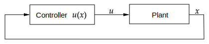

# (Method) LQR Controller




The LQR (Linear Quadratic Regulator) is a method for finding a feedback control $u(x) = -K x$ for a linear system
which is optimal in the sense of minimizing a quadratic cost function.


### Discrete Time

For a discrete time system

$$
x_{k+1} = Ax_k + Bu_k
$$

the LQR problem is given by the following infinite-time discrete optimal control problem:

$$
\begin{aligned}
\min_{x_0,u_0,\dots}\quad&\sum_{k=0}^{\infty} x_k^\top Q x_k + u_k^\top R u_k + 2 x_k^\top S u_k \\
\text{s.t.}\quad & 0 = x_0 - \bar{x}_ 0 \\
&  0 = x_{k+1} - A x_k - B u_k, \quad k=0,1,\dots
\end{aligned}
$$

Here $Q$ and $R$ are symmetric matrices to balance the cost function between the state and control variables, typically diagonal. 
The matrix $S$ is optional, but it can be used to couple the state and control variables in the cost function.

In this case, the *algebraic Riccati equation in discrete time* is given by

$$
P = Q + A^\top  P A - (S^\top  + A^\top  P B)(R + B^\top  P B)^{-1}(S + B^\top  P A).
$$

This is a nonlinear matrix equation in the symmetric matrix $P$, i.e., with $n_x(n_x+1)/2$ unknowns. It can either be solved by an iterative application of the difference Riccati recursion or by faster converging procedures such as Newton-type methods, where, however, care has to be taken to avoid possible shadow solutions that are not positive definite. 

It's solution yields the feedback matrix:

$$
K = (R + B^\top  P B)^{-1}(S + B^\top  P A)
$$

The `python-control` library provides the function
```python
control.dlqr(A, B, Q, R)
```
to compute a feedback matrix $K$.


### Continuous Time
For continuous time systems, the infinity-time continuous optimal control problem is given by

$$
\begin{aligned}
\min_{x(t),u(t)}\quad &\int_{0}^{\infty} x(t)^\top Q x(t) + u(t)^\top R u(t) + 2 x(t)^\top S u(t)  \\
\text{s.t.}\quad & 0 = x(0) - \bar{x}_ 0 \\
&  0 = \dot{x}(t) - f(x(t), u(t)), \quad \forall t \in [0,\infty]
\end{aligned}
$$

with linear system $\dot{x} = Ax + Bu$ and quadratic cost function characterised by the matrices $Q$, $R$, and $S$.

From the Hamilonian-Jacobi-Bellman optimality conditions, we find that the feedback matrix $K$ is given by:

$$
K = R^{-1} (S + B^T P)
$$

where $P$ is the solution of the continuous-time algebraic Riccati equation:

$$
0 = Q + PA + A^\top P − (S^\top  + PB)R^{-1}(S + B^\top P).
$$

For this, we can use Newton-Iteration, the `python-control` library also provides the function
```python
control.lqr(A, B, Q, R)
```

## Further Literature:

- **Brian Douglas**, *What is Model Predictive Control?*, YouTube, 2015. Available online: https://www.youtube.com/watch?v=E_RDCFOlJx4.


- **Moritz Diehl and Sébastien Gros**, _Numerical Optimal Control_. Available online: [http://www.syscop.de/numericaloptimalcontrol](http://www.syscop.de/numericaloptimalcontrol).
