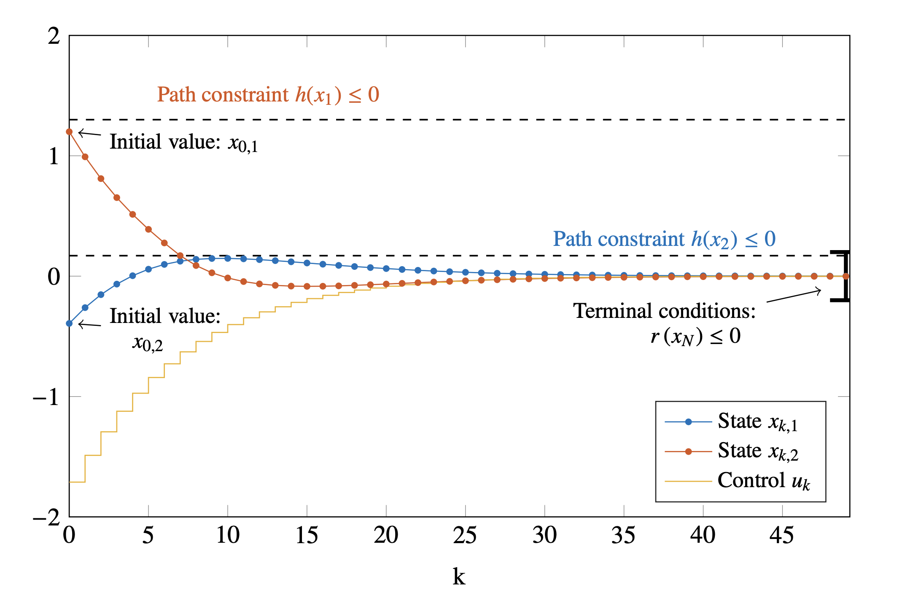

# Open Loop Planning
We are considering for a real-life system, which we model using an ordinary differential equation 

$$
\begin{aligned}
	\dot{x} = f(x,u)
\end{aligned}
$$

with state $x\in \mathbb{R}^{n_x}$, and control $u\in \mathbb{R}^{n_u}$. We want to find a find a control strategy $u(t)$ such that the trajectory $x(t)$ that the system (hopefully) follows in the future, is optimal in the sense of some cost function.
## Discrete Dynamics

For simplicity, we assume in the following that we approximate the continuous state trajectory $x(t)$ on grid points $t_0, t_1, \dots, t_k, t_{k+1}, \dots$ as $x(t_k) \approx x_k$. Also, for simplicity, we assume that over each interval the control is constant: $u(t) = u_k, \forall  t \in [t_k, t_{k+1}]$, and that the intervals have the same constant duration, $h = t_{k+1} - t_k$.
Then we can find discrete dynamics:

$$
\begin{aligned}
	x_{k+1} = F(x_k, u_k)
\end{aligned}
$$

which can be obtained from a continuous-time ODE using a single (or multiple) steps of a one-step integration method. A commonly used integration method is the Runge-Kutta method of order 4:

$$
\begin{aligned}
	x_{k+1} = ...
\end{aligned}
$$


We already implemented such a function in the code, a single step:
```python
F = model.discreteDynamics(h)
x_1 = F(x_0, u_0)
```
## Discrete Optimal Control Problem


Given the system model and constraints, a quite generic discrete time optimal control problem can be formulated as the following constrained NLP:

$$
\begin{aligned}

\min_{x_0,u_0,x_1,u_1} &\sum_{k=0}^{N-1} l(x_k,u_k) + E(x_N) \\
\text{s.t.}\quad & 0 = x_0 - \bar{x}_0 \\&  0 = x_{k+1} - F(x_k, u_k), \quad &k=0,\dots,N-1 \\
&  0 \leq h(x_k, u_k), \quad &k=0,\dots,N-1 
\end{aligned}
$$

- The decision variables of the problem contain the *discrete* state and control trajectories on the time grid. We have $N+1$ variables 
	$$\begin{aligned}x_0,x_1, \dots, x_N\end{aligned}$$ 
	
	for the state trajectory each of which is of a vector of $n_x$ variables, and $N$ variables for  the control trajectory:
	
	$$\begin{aligned}
	u_0, u_1, \dots, u_{N-1}
	\end{aligned}
	$$
	
	each of which is a vector of size $n_u$.
- The trajectory should satisfy some constraints, for example simple bounds, this is expressed in the inequality for each state and control pair
  
  $$
  \begin{aligned}
  h(x_k, u_k)
  \end{aligned}
  $$
  
- Most importantly, the trajectory that we plan, should satisfy the discrete dynamics of the system, and should start at some initial point $\bar{x}_0 \in \mathbb{R}^{n_x}$, given by the equality constraints:
  
  $$
  \begin{aligned}& 0 = x_0 - \bar{x}_0 \\
  &  0 = x_{k+1} - F(x_k, u_k), \quad &k=0,\dots,N-1 \end{aligned}
  $$
  
- The cost function is divided into a *stage cost*  $l(x_k, u_k)$ for each interval and a terminal cost $E(x_N)$ for the terminal node. A very common example is a *tracking cost* 
  $$
  \begin{aligned}\sum (x_k - \bar{x}_k)^\top Q (x_k - \bar{x}_k) + (u_k - \bar{u}_k)^\top R (u_k - \bar{u}_k) \end{aligned}
  $$
  
  when we want to find a control which makes the system follow a given reference of states $\bar{x}_0, \bar{x}_1, \dots,$  and controls  $\bar{u}_0, \bar{u}_1, \dots,$. Here $Q$ and $R$ are (typically diagonal) *weighting matrices*, to emphasise the importance of either control or state tracking.

## Practical Solution of the Nonlinear Programm
The nonlinear program above is of the general form

$$
\begin{aligned}\min_w\quad& f(w) \\
\text{s.t.}\quad& 0 = g(w) \\
& 0 \leq h(w)
\end{aligned}
$$

with variables $w$, objective function $f$, equality constraints $g$ and inequality constraints $h$. Such an NLP can be formulated and solved using a number of tools:
- The `Python/Matlab` framework [`CasAdi`](https://web.casadi.org/) which, when installed for Python using `pip install casadi` comes natively with the very robust solver `IPOPT`which is called using the `nlpsol` function.
- The Python library `scipy`,  provides the function [`scipy.optimize.minimize`](https://docs.scipy.org/doc/scipy/reference/generated/scipy.optimize.minimize.html).
- Matlabs `optim` toolbox provides the function [`fmincon`](https://www.mathworks.com/help/optim/ug/fmincon.html).

## Extended Literature:
- **Moritz Diehl and Sébastien Gros**, _Numerical Optimal Control_. Available online: [http://www.syscop.de/numericaloptimalcontrol](http://www.syscop.de/numericaloptimalcontrol).
