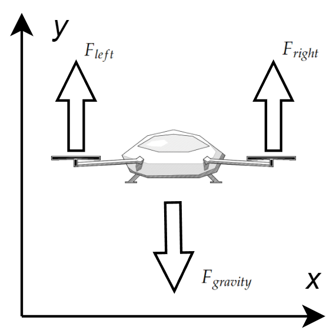

# (Scenario) 2D-XY Bicycle Control
*Future PhD workshop, Hannover, April 2025, Jakob Harzer, Yunfan Gao, Moritz Diehl*

## Dynamics:

$$
\begin{aligned}
x = \begin{bmatrix}
p_x \\ p_y \\ \theta
\end{bmatrix} \in \R^3 && u = \begin{bmatrix}
\delta \\ V
\end{bmatrix} \in \R^2
\end{aligned}
$$

with position $p_x$, $p_y$ \[$\mathrm{m}$\], and heading angle $\theta$ \[$\mathrm{rad}$\] relative to the $x$-axis. The vehicle is controlled with a specific steering angle $\delta$ \[$\mathrm{rad}$\]  and a fixed velocity $V$ \[$\mathrm{rad}$\] . 

$$
\begin{aligned}
\begin{bmatrix}
\dot{p}_x \\ \dot{p}_y \\ \dot{\theta}
\end{bmatrix} = \dot{x} = f(x,u) =  \begin{bmatrix}
V \cos(\theta + \beta) \\ V \sin(\theta + \beta) \\ \frac{V}{l_\mathrm{r}}\sin(\beta)
\end{bmatrix}
\end{aligned}
$$

The *side-slip angle* $\beta$ is given as

$$
\beta = \arctan\left(\frac{l_\mathrm{r} \tan(\delta)}{l_\mathrm{r} + l_\mathrm{f}}\right)
$$
and depends on the distances $l_\mathrm{r},l_\mathrm{f}$, of the center of mass to the front and rear wheels, in the plot we have $L = l_\mathrm{r} + l_\mathrm{f}$.
## Ideas for Projects
- (MEDIUM) collision avoidance (Open Loop Planning)
- (MEDIUM) car parking problem (Open Loop Planning)
- (HARD) collision avoidance (MPC)