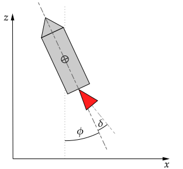

# Scenario - 2D-XZ Rocket Control
*Future PhD workshop, Hannover, April 2025, Jakob Harzer, Yunfan Gao, Moritz Diehl*

In this scenario we consider a rocket in the 2D xz-plane:

## Dynamics

$$
\begin{aligned}
x = \begin{bmatrix}
p \\ 
v \\ 
\phi \\ 
\dot{\phi}
\end{bmatrix} = \begin{bmatrix}
p_x \\ 
p_z \\ 
v_x \\ 
v_z \\ 
\phi \\ 
\dot{\phi}
\end{bmatrix}\in \mathrm{R}^6 && u = \begin{bmatrix}
T \\
\delta
\end{bmatrix} \in \mathrm{R}^2
\end{aligned}
$$

with 2D position $p \in \mathrm{R}^2$, velocity $v \in \mathrm{R}^2$, orientation angle $\phi$ relative to the vertical axis and rotational velocity $\dot{\phi}$, $\dot{\phi} >0$ is a counterclockwise rotation. The rocket is controlled using a thrust-vectoring system where the direction of the thrust can be changed using a gimbal.

The following forces act on the rocket:
- The thrust force $T$ given by the first control

$$
F_\mathrm{T} = T \begin{bmatrix}  \sin(\phi + \delta) \\
\cos(\phi + \delta)\end{bmatrix}
$$

- Gravity

$$
F_g = \begin{bmatrix}0 \\
-m g\end{bmatrix}
$$

- Optional: aerodynamic drag force 

$$F_D(v, v_\mathrm{wind}) = ?$$

The force from the thruster no only acceleartes the rocket but also creates a moment

$$
M_\mathrm{T} = r \times F_\mathrm{T} = T \cdot d \cdot \sin(\delta)
$$

which rotates the drone around it's center of mass.
Here $r$ is the vector of lenght $d$ from the drones center of mass to the thruster.
The dynamics are then given by:

$$
\begin{aligned}
\begin{bmatrix}
\dot{p} \\ 
\dot{v} \\
\dot{\phi} \\
\ddot{\phi}
\end{bmatrix} = \dot{x} = f(x,u) =  \begin{bmatrix}
v \\
m^{-1}(F_\mathrm{T} + F_g) \\
\dot{\phi} \\
I^{-1} M_\mathrm{T}
\end{bmatrix}
\end{aligned}
$$

## Ideas for Projects
- (MEDIUM) Use an LQR/PID controller to stabilize the drone.
	- (MEDIUM) Extend the drone model with a airdrag force, stabilize the drone against a strong wind gust.
	- (MEDIUM) USE an LQR controller to track a reference
- (MEDIUM) Plan an open-loop trajectory for a point-to-point motion by solving an OCP.
	- (HARD) Plan a time-optimal trajectory
- (MEDIUM) Implement a tracking MPC-Controller
	 - (HARD) Implement a collision-avoidance tracking MPC controller for two drones.

## Details

| State                                     | Symbol               | Unit          |
| ----------------------------------------- | -------------------- | ------------- |
| XZ - position of the rocket                | $p \in \mathbb{R}^2$ | m             |
| XZ - velocity of the rocket                | $v \in \mathbb{R}^2$ | $\mathrm{kg}$ |
| orientation relative to the vertical axis | $\phi $              | rad           |
| angular velocity                          | $\dot{\phi}$         | rad/s         |

| Parameter                   | Symbol | Value | Unit                      |
| --------------------------- | ------ | ----- | ------------------------- |
| distance to center of mass to thruster           | $d$    | ?     | $\mathrm{cm}$             |
| mass                        | $m$    | ?  | $\mathrm{kg}$             |
| rotational interia          | $I$    | ?     | $\mathrm{kg}\mathrm{m}^2$ |
| acceleration due to gravity | $g$    | 9.81  | $\mathrm{ms^{-2}}$        |
